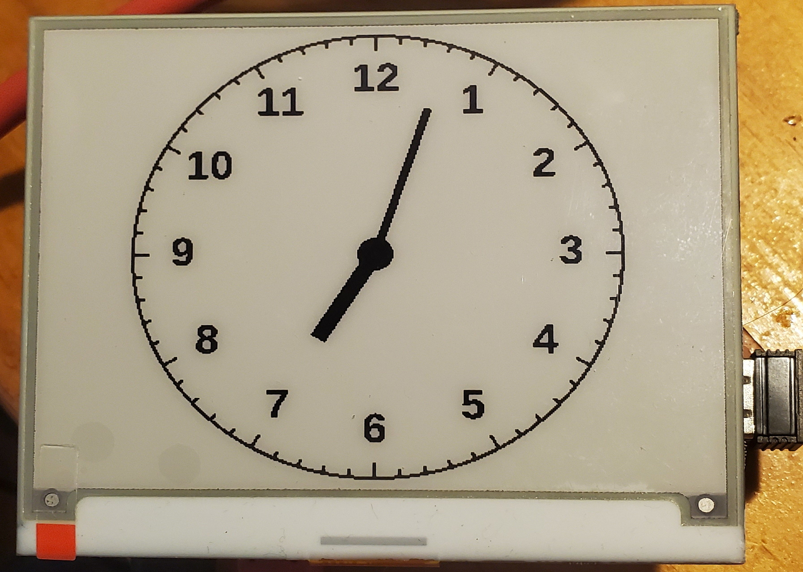

# eink-clock
 generates clockface and uploads it to an eink panel once a minute 



# install
to install, run (from "sudo su" prompt):
```bash
 root@2020pi:~# mkdir -p build
 root@2020pi:~# cd build/
 root@2020pi:~/build# git clone https://github.com/mzandrew/eink-clock.git
```

to run at every boot, edit /etc/rc.local
```bash
 root@2020pi:~# vim /etc/rc.local
```
add a line to that file like so (before the exit 0 line):
```vim
 /root/build/eink-clock/clock.py &
```

reboot and enjoy!

# notes

Yes, this is a black-white-red panel, but the updates are too slow to make the extra color worth it, so it is operated in just black-white mode.

# thanks

Kudos to the scipython team for posting [code to generate clockfaces](https://scipython.com/blog/generating-an-svg-clock-face/) and to the pimoroni team for posting good [instructions on how to use their panels](https://learn.pimoroni.com/tutorial/sandyj/getting-started-with-inky-phat).

# future

It would be great if the inkyhat library supported partial updates (red second hand?)...
